# The Documentation Flywheel

How documentation in this repository gets written, reviewed, and kept current.

This is the process the repository exists to demonstrate. Everything else here
— the schema, the renderer, the pipeline, the templates — is machinery in
service of this loop.

> All examples below use the fictional Northwind Traders dataset.

---

## Purpose

To keep architecture documentation current **without anyone being assigned to
keep it current**.

The failure mode this is designed against is specific and near-universal:
documentation is written once, by one person, in a tool separate from the work.
That person becomes its owner. They get busy. Six months later nobody trusts
it, so nobody reads it, so nobody updates it, and the next initiative starts
from scratch.

Every step below exists to remove one of the reasons that happens.

---

## Scope

**Covered:** application inventory records, integration records, architecture
diagrams, process documents, decision records, the insight register, and the
question register.

**Not covered:**

- Production change control. Documenting a change is not approving it — see
  [context/decision-rights.md](../context/decision-rights.md).
- Incident response and post-incident review, which have their own path.
- Anything requiring the transcript to leave the repository, which nothing does.
- Sensitive material. Credentials, personal data, and commercially confidential
  terms do not go in a transcript, a summary, or a record. If an interview
  strays into one, it is cut before the transcript is committed.

---

## Roles

| Role | Who | Does |
|---|---|---|
| **Interviewer** | Whoever is driving the documentation work | Takes the briefed questions into a meeting that was happening anyway, runs the conversation, commits the transcript |
| **Subject matter expert** | The person who knows the system | Turns up and answers questions. **That is the entire commitment.** |
| **AI assistant** | — | Runs the gap analysis, keeps the register current, preps the interview briefs, and drafts every change from the transcript. Drafts only — it never merges. |
| **Reviewer** | A second person, ideally the SME | Confirms the drafted changes say what the conversation meant |
| **Approver** | Per [decision-rights.md](../context/decision-rights.md) | Approves anything that is a decision rather than a record |
| **Pipeline** | CI | Validates, renders, verifies, publishes. Has no judgment and needs none. |

---

## The loop



**Steps 1 to 3 are the assistant's prep and happen on a branch. Step 4 is the
human gate. Steps 5 and 6 are the conversation and its processing — and step 6
*is* steps 1 to 3 for the next round.** After the first turn the whole thing
settles into three beats: approve, talk, process.

The single most important consequence: **one pull request carries both the
closeout of the last conversation and the prep for the next one.** You never
merge and then wonder what to do; the merge itself hands you a briefed
interview.

### 1. The machine reports what is missing

Start from what is already known to be missing rather than from a blank page.

```bash
python automation/gap-analysis.py
```

That produces the machine-detectable gaps — unknown owners, undetermined
hosting, uncharacterized failure modes, applications with no integration
records. The human-noticed ones live in
[insights-surfaced.md](../inventory/insights-surfaced.md) and in the open
questions at the bottom of the last meeting summary.

Turn the gaps into **questions with a name attached**. Not "hosting is TBD for
the plant historian" but "Tom — is the historian inside the plant network
boundary or the corporate one, and who patches it?" A gap is a data problem. A
question is something a person can answer in a sentence.

### 2. Questions and names collect in the register

Everything found in step 1 goes into
[evidence/question-register.md](../evidence/question-register.md), and stays
there until a conversation closes it.

This is the step that makes the loop self-driving rather than merely
self-describing. Without it, each turn starts by rediscovering what the last
turn already knew was missing, and the questions that nobody happened to
remember quietly disappear. The register is the memory between turns.

**Every row carries a name.** A question with no name against it does not get
asked — it reads as a to-do for everybody, which means nobody. So the register
holds three things:

| | |
|---|---|
| **Open questions** | What is not known, who can answer it, where the gap came from |
| **People to identify** | Roles named in a conversation as "you'd have to ask…" and never resolved to an actual person |
| **Answered** | Closed questions with the conversation that closed them. Kept, not deleted. |

The second table is the one that earns its place. A question waiting on
scheduling gets asked eventually; a question waiting on *finding somebody* sits
untouched until a person goes looking, and nothing else in the repository would
surface it. Three questions in the register are blocked this way right now.

**Sorting the register by who can answer produces the interview list.** That
is the whole function: the top of the register says who to talk to next and
what it unblocks, so the question "who should we interview?" has an answer
sitting in a file rather than depending on whoever remembers the most.

Roles named here do **not** go into `inventory/schema.yaml`. The roster is the
controlled list of people who own records; the register is a list of people to
find. They join the roster if they turn out to own something.

### 3. Interview briefs are prepared, one per person

The register says who to talk to. The brief is what you walk in with.

The assistant writes one file per person in
[evidence/interviews/](../evidence/interviews/), pulling that person's rows out
of the register and turning them into something usable in a room:

| Section | Why it is there |
|---|---|
| **Why this person** | One line. Stops a brief being prepped out of habit. |
| **How they think** | Two lines from [context/people.md](../context/people.md). Tells you how to phrase the question so it lands. |
| **The questions** | Ordered, each written as you would actually say it out loud — not as the register phrases it |
| **What a good answer looks like** | Per question. Tells you when to stop pushing, which is the hard part live. |
| **If there is time** | The lower-priority rows, explicitly demoted so they do not crowd out the important ones |
| **Names to chase** | Who from the people-to-identify table this person might be able to name |
| **Do not ask** | Already answered elsewhere. Their time is the scarce resource in this whole method; spending it on a restatement is the one unforgivable move. |

Three properties matter:

- **One person, one file.** A combined agenda for five people is a document
  nobody reads before a meeting with one of them.
- **Only for conversations that are actually coming up.** A brief for a meeting
  with no date is a to-do list wearing a costume. The queue at the top of the
  register carries the *next opportunity*; brief the people who have one.
- **Written for the room, not for the repository.** The register is a data
  structure. The brief is a script. `Q-009 — hosting: TBD` becomes *"Where does
  the historian actually run — is there a box in the plant, or is it in the
  DC?"*

**These are drafted, not generated.** Everything else derived in this repo is
machine-written, and it was tempting to make this the same. It is not, for two
reasons: the register is prose rather than structured data, and the value in a
brief is in the framing — knowing that Tom will answer a tiering question in
recovery windows, and asking it that way. That is a judgment call, which means
a human reviews it in step 4 like everything else.

Briefs are living files. A question answered drops off; a question raised
appears. They are refreshed every round in step 6, not written once.

### 4. A human approves; the pipeline republishes

**This is the gate, and it sits in the middle of the loop rather than at the
end.**

Open a pull request per
[standards/pull-request-policy.md](../standards/pull-request-policy.md).
`validate.yml` checks every record against the schema and parses every diagram.
A reviewer checks the thing a schema cannot: whether the register reflects what
is actually unknown, and whether the briefs ask the right things in a way the
person will engage with.

On merge, `render.yml` regenerates the views, the per-application pages, and
the landscape diagram, verifies the output, and commits it back.

Two things are true after that merge, and both matter:

1. **The published documentation is current.** Anyone walking into the
   conversation — or reading over someone's shoulder afterwards — is looking at
   the same picture.
2. **The brief for the next conversation is in the repository, reviewed.** Not
   in someone's notes app, not reconstructed from memory on the walk to the
   meeting room.

The assistant never merges. It drafts and hands over; a human approves every
word that gets published. The schema gate backs this up mechanically — an
assistant cannot invent a person into the owner roster, because the roster is a
controlled list and an unknown value fails validation
([DEC-003](../decisions/decision-log.md)). The guarantee does not depend on the
model behaving well.

### 5. The conversation happens, brief in hand

**This is the step the whole method turns on.**

Do not schedule a documentation session. Find a meeting that is already
happening for its own reasons — an integration review, a vendor renewal, a
project kickoff, a handover — and ask the questions there. Record it.

You walk in with that person's brief, merged and current. That is the whole
point of putting the gate at step 4: the preparation is done, reviewed, and
published *before* the conversation, so the meeting itself costs the
interviewer nothing but attention.

The expert's commitment is to turn up and talk, which they were doing anyway.
They write nothing, review no draft they did not ask to see, and own no
document afterwards. **The process creates no homework for the person whose
time is scarcest.**

That is why this loop compounds where documentation initiatives usually stall.
Every conventional approach eventually asks the expert to write something, and
that is the point at which it stops.

Practical notes:

- Say at the start that it is being recorded and why. Nobody has objected; not
  asking is how you get someone who does.
- A bad recording is fine. Transcription handles cross-talk and accents better
  than it handles someone paraphrasing later from memory.
- Twenty minutes of specifics beats an hour of context. The context is already
  in [context/](../context/).
- Mark the brief's questions as you go, or immediately after. Which ones did
  not get asked is information; it is also the thing you will have forgotten by
  the afternoon.

### 6. The transcript is processed — which is steps 1 to 3 again

Commit the raw transcript to `evidence/meetings/` as
`YYYY-MM-DD-description.md`, unedited except for anything that should not be
written down at all. The transcript is the **evidence**: when a record says the
EDI path loses documents during an outage, the summary links to the
conversation where somebody said so. That link is the difference between
documentation and assertion, and it is what makes a two-year-old record still
worth trusting.

Then run [templates/prompt-process-transcript.md](../templates/prompt-process-transcript.md).
The assistant reads the transcript against the existing records and proposes:

- Updates to application and integration records
- New or amended process documents
- Decision records where something was actually decided
- Diagram source changes where the shape of the system changed
- New rows for the insight register
- **A summary document** — see below
- **Updates to the question register** — closing what was answered, appending
  what was raised
- **Refreshed interview briefs** — answered questions drop off, new ones land
  against whoever can answer them, and the brief for the *next* person is ready

**Propose before writing.** The assistant lists the file paths and what changes
in each, and waits. This is the point at which "the transcript said X" gets
checked against "the record already says Y" cheaply.

Then it re-runs the gap analysis against the updated records — which is step 1
— reconciles the register — step 2 — and re-preps the briefs — step 3. The
prep for the next round and the closeout of the last one land in the same pull
request, and step 4 approves both at once.

**That is the loop closing.** The regenerated views raise questions the
previous version could not: a new integration record changes what the DR
posture view shows, which raises a failover question nobody had considered.
Those questions go into the register, get a name, become a brief, and get
asked. Nothing in the chain depends on anyone's recall.

---

## The steady state

The six steps above describe a full turn from a standing start. Once it is
running, it is three beats:

| Beat | Who | What |
|---|---|---|
| **Approve** | Human | Merge the PR. It carries the last conversation's closeout *and* the next one's brief. Pipeline republishes. |
| **Talk** | Human + SME | The meeting that was happening anyway. Brief in hand. Recorded. |
| **Process** | Assistant | Transcript in, records and register and briefs out, new PR opened |

Round and round. The thing that makes it turn rather than stall is that no beat
ever ends with "and then someone should figure out what's next" — each one
hands the next a finished artifact.

---

## The summary is not optional

Every transcript gets a `.md` summary alongside it, using
[templates/meeting-summary-template.md](../templates/meeting-summary-template.md).

**A transcript without a summary has not been processed.** The summary is the
linkable artifact, the proof the conversation was mined, and the thing anyone
will actually read — nobody reads a transcript twice. A folder of unprocessed
recordings is the same failure as an unmaintained wiki wearing different
clothes.

---

## Insights are a first-class output

While drafting, capture what the conversation revealed about the *organization*
rather than about the systems. The questions in
[ai-guidance.md](../meta/ai-guidance.md) are the checklist; the register is
[insights-surfaced.md](../inventory/insights-surfaced.md).

This is usually where the value turns up. Nobody sets out to discover that one
person owns both integration paths, or that a Tier 2 system sits inside a
Tier 1 transaction. Those came out of asking ordinary structured questions
about systems and writing the answers down in a form where they could be
grouped.

Rows are appended, never edited. An insight since resolved is still evidence
the process found it.

---

## Exceptions and edge cases

| Situation | What to do |
|---|---|
| **No meeting is coming up.** | Do not schedule one for documentation's sake — it converts a no-homework process into homework and it will be cancelled twice before it happens. Wait, or ask the two highest-value questions by email. |
| **The SME contradicts an existing record.** | Both may be true at different times. Record what they said, link the evidence, and flag the conflict in the summary. Do not silently overwrite a record that has a source behind it. |
| **The conversation reveals something sensitive.** | Cut it from the transcript before committing. If it must be recorded, record its existence and where the detail lives, not the detail. |
| **The transcript contains a decision.** | It is a decision record, not a summary row. Use [templates/prompt-write-decision-record.md](../templates/prompt-write-decision-record.md) and get the approver from the matrix. |
| **A new person or vendor is named.** | Add it to `schema.yaml` in the same pull request, with approval per the matrix. Do not work around the gate. |
| **A change is needed during the freeze.** | Documentation changes are never frozen. Nothing here moves production. |
| **Nobody knows the answer.** | That is a result. Record `Unknown`, keep the question open in the register, and add an insight row — see [DEC-011](../decisions/decision-log.md). Never fill a field with something plausible to make it look complete. |
| **Nobody can be identified to ask.** | Record the *role* in the register's people-to-identify table, with who might know the name. Finding the person becomes the open item. This is the most commonly skipped step and the one that quietly ends loops. |
| **The register gets long.** | Expected, and not a problem on its own — it is a backlog, not a to-do list. If it becomes unreadable, that is a signal to close the rows that stopped mattering, with a one-line reason each. Do not delete them. |
| **The meeting gets cancelled.** | Leave the brief. It is still correct, and rescheduling costs nothing. Only refresh it when the register changes underneath it. |
| **The conversation went somewhere else entirely.** | Normal, and often better than the plan. Process what was actually said; the unasked questions stay open in the register and go back on the next brief. A brief is a prompt, not an agenda to enforce. |
| **A brief exists for someone with no scheduled meeting.** | Delete it, or mark it *unscheduled*. Briefs for meetings that are not happening are the beginning of the pile of documents nobody reads. |
| **Two people can answer the same question.** | It goes on both briefs. Whoever is asked first closes it, and the other brief drops it on the next refresh. |
| **The assistant proposes something wrong.** | Reject it in review; that is what review is for. If it was wrong because a document was misleading, fix the document — that is a bug in [meta/](../meta/), not in the model. |
| **A generated file needs to change.** | It does not. Change the source data and re-render. See [repo-conventions.md](../meta/repo-conventions.md). |

---

## Why it works

Four properties, each doing a specific job:

1. **No homework for the expert.** The only scarce resource is the SME's
   attention, and the process spends none of it on writing.
2. **The register is the memory, and the brief is the handoff.** What is
   unknown and who could tell us survives between turns in a file rather than
   in whoever ran the last one — and it arrives at the next conversation as
   something you can read on the walk there. This is what lets the loop pause
   for a month and resume without restarting.
3. **Text as source.** Reviewable, diffable, and readable by a model — which is
   what makes step 6 possible at all.
4. **Enforcement in the pipeline, not in policy.** A bad value fails the build.
   Nothing depends on everyone remembering the rules.

The compounding comes from the return path. Each turn produces documentation
that is better at exposing what is still unknown, so the next set of questions
is sharper than the last. The loop gets more useful the longer it runs, which
is the opposite of how documentation normally ages.

The failure mode to watch for is a register that only grows. Rows arriving and
never leaving means conversations are not happening — which the file makes
visible early, and which nothing else in the repository would show at all.

---

## Related

- [evidence/question-register.md](../evidence/question-register.md) — the collector; what is unknown and who can answer it
- [documentation-flywheel.d2](../diagrams/source/documentation-flywheel.d2) — the diagram source
- [templates/](../templates/) — a prompt per recurring job
- [standards/pull-request-policy.md](../standards/pull-request-policy.md) — how a change gets merged
- [context/decision-rights.md](../context/decision-rights.md) — who approves what
- [evidence/interviews/](../evidence/interviews/) — the current briefs
- [meta/ai-guidance.md](../meta/ai-guidance.md) — the assistant-facing version of steps 1 to 3 and 6

---

*Last updated: 2026-08-04*
